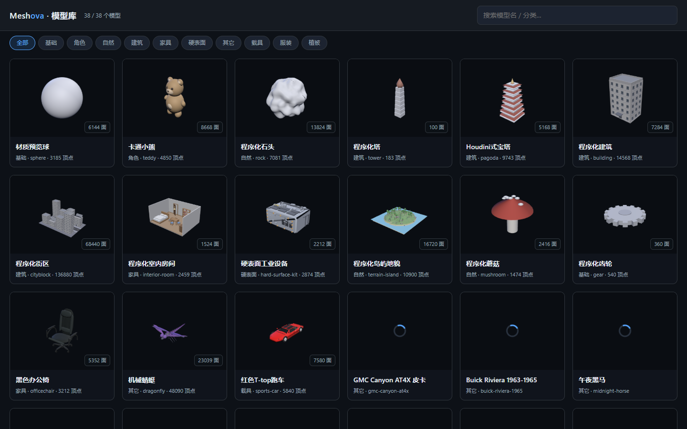
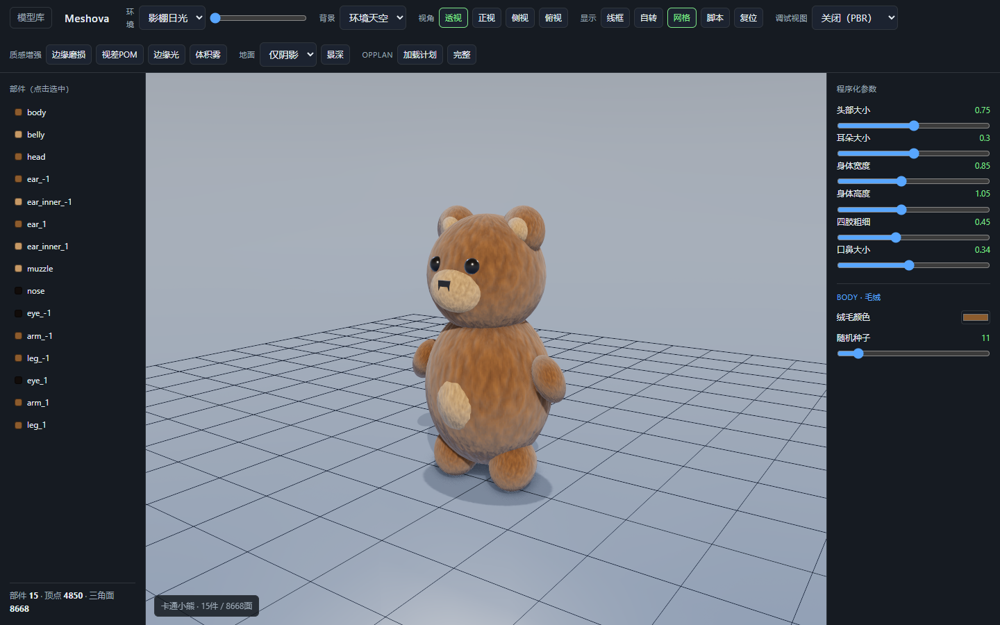
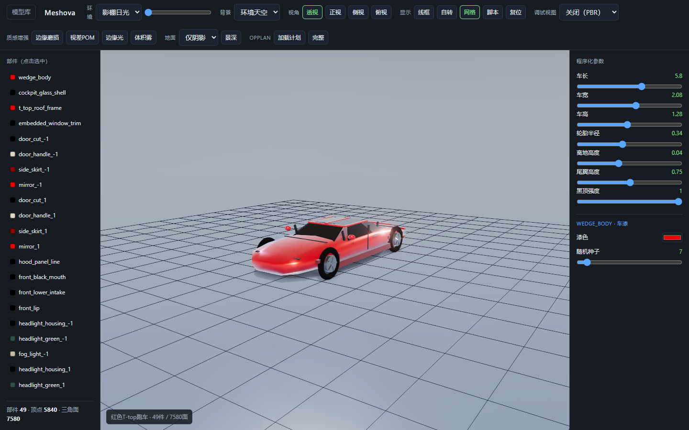

# Meshova

Web procedural modeling + procedural PBR material library, driven by AI-written scripts.

## 在线预览

<p>
  <a href="https://wellingfeng.github.io/Meshova/index.html">
    <strong>打开 Meshova 在线模型库</strong>
  </a>
</p>

<p>
  <a href="https://wellingfeng.github.io/Meshova/index.html">
    
  </a>
</p>

<p>
  
  
</p>

- **Script-first DSL** (restricted TypeScript calling the library), not node graphs — code is the AI's native language.
- **WebGPU** for compute acceleration and PBR + IBL rendering.
- **Headless screenshot loop** so an AI can write a script → render → self-evaluate the image → revise. This visual self-iteration is the core differentiator vs. black-box text-to-3D.
- **Shared kernel**: geometry and material reuse the same noise/pattern functions, sandbox, screenshot loop, and AI orchestration. Geometry ships first; material is a small increment on top.

Self-rewritten from public algorithm knowledge. MIT licensed. Blender source is used only as a read-only algorithm reference, never copied (GPL).

## Status

Implemented core stack:

| Module | What |
| --- | --- |
| `math` | immutable `vec2` / `vec3` / scalar helpers (clamp, lerp, remap, smoothstep) |
| `random` | deterministic seeded PRNG (xoshiro128**), `fork()` for independent streams |
| `random` | seeded Perlin noise (`noise2`/`noise3`) + fractal Brownian motion (`fbm2`/`fbm3`) |
| `sandbox` | restricted script execution with a loop guard (op budget + wall-clock timeout) |
| `geometry` | primitives, transforms, curves/sweep, scatter, CSG, subdivision, fields |
| `geometry` | Houdini-style `Ramp`, `PointCloud`, `InstancePlan`, `copyToPoints` flow |
| `texture` | procedural PBR fields, presets, PNG export, browser material baking |
| `viewer` | live procedural model editor plus headless screenshots |

Determinism is a hard requirement: same seed → same result, so screenshot tests and AI reproduction stay stable.

## Develop

```bash
pnpm install
pnpm test        # vitest
pnpm typecheck   # tsc --noEmit
pnpm build       # emit dist/
pnpm view        # live viewer
```

See [CONTRIBUTING.md](CONTRIBUTING.md) for the workflow, hard invariants, and
how to update the deterministic shape-regression baseline.

## Example: copy-to-points flow

```ts
import { box, copyToPoints, makePointCloud, pointAttribute, storePointAttribute, vec3 } from "meshova";

let pc = makePointCloud({ points: [vec3(0, 0, 0), vec3(2, 0, 0)] });
pc = storePointAttribute(pc, "scale", (ctx) => 1 + ctx.index);

const instances = copyToPoints(pc, box(1, 1, 1), {
  scale: pointAttribute("scale"),
  alignToNormal: false,
});
```

## Example: deterministic noise

```ts
import { makeNoise, fbm2, makeRng } from "meshova";

const noise = makeNoise(7);
const height = fbm2(noise, 0.5, 0.5, { octaves: 5 });

const rng = makeRng(7);
const jitter = rng.range(-0.1, 0.1); // same seed → same value, every run
```

## License

MIT. See [LICENSE](./LICENSE).
