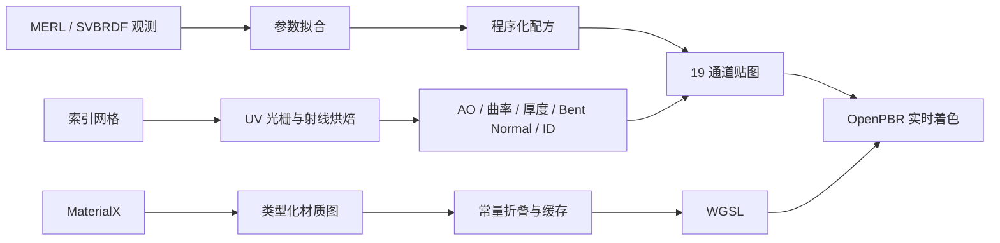

# 第八批：实时材质编译与高级材质

最后更新：2026-07-12

本批把 19 通道程序化材质接入可执行 WGSL、真实网格属性烘焙和实测 BRDF 参数拟合。核心代码位于 `src/texture/realtime-material-system.ts`，高级材质位于 `src/texture/eighth-batch-materials.ts`。

## 快速使用

烘焙全部 10 套材质：

```bash
pnpm build
pnpm materials-eighth:bake -- 512
```

只烘焙一套：

```bash
pnpm materials-eighth:bake -- 512 solidOpticalGlass
```

输出位于 `out/materials/eighth-batch/<材质名>/`。每套包含 19 张 PNG、OpenPBR JSON、MaterialX 和 WGSL、实时清单，共 23 个文件。

## 数据流



## 公开 API

### `bakeMeshMaterialInputs(mesh, options)`

把带 UV 的 `Mesh` 烘焙到纹理空间。

- `width`、`height`：输出尺寸，默认 `256`。
- `bentNormalSamples`：每顶点半球射线数，默认 `12`。
- `rayDistance`：AO 最大射线距离，默认网格包围盒对角线的 `35%`。
- `padding`：UV 岛边缘扩张像素数，默认 `4`。
- 返回：原有几何通道、`bentNormal` 和 `report`。
- 抛错：原有 `primitiveIds` 或 `materialIds` 长度不等于三角形数。

复杂度约为 `O(V * S * F + P)`。`V` 为顶点数，`S` 为射线数，`F` 为面数，`P` 为光栅像素数。高模应先代理烘焙或分块；当前实现未建 BVH。

```ts
import { bakeMeshMaterialInputs, box } from "meshova";

const bake = bakeMeshMaterialInputs(box({ size: 1 }), {
  width: 256,
  height: 256,
  bentNormalSamples: 16,
  padding: 8,
});

console.log(bake.report.meanAo, bake.report.overlapPixels);
```

### `compileMaterialGraphToWgsl(graph)`

编译类型化材质 DAG。编译器执行拓扑排序、常量折叠和内容哈希缓存；相同图对象内容返回同一编译结果。`evaluateCpu()` 复用 CPU 图执行器，用于 CPU/GPU 对照测试。

支持节点：`input`、`constant`、`add`、`multiply`、`min`、`max`、`clamp`、`mix`。循环、缺失引用和类型不一致会抛错。

### `compileMaterialXToWgsl(document)`

解析 Meshova 可移植 MaterialX 子集并编译 WGSL。

支持：

- `image`、`constant`、`add`、`multiply`。
- `standard_surface` 的纹理引用与内联常量输入。
- `float`、`color3`、`vector3`；`vector3` 在材质图中按三通道值处理。

不支持任意第三方 MaterialX 节点定义、闭包图、条件分支和自定义代码生成。遇到无 `standard_surface` 输出或缺少必需属性时抛错。

### `OPENPBR_REALTIME_WGSL`

固定 19 层 `texture_2d_array` 着色器。通道顺序由 `REALTIME_MATERIAL_CHANNELS` 定义：

`baseColor`、`metallic`、`roughness`、`normal`、`ao`、`height`、`emission`、`opacity`、`transmission`、`anisotropy`、`anisotropyRotation`、`clearcoat`、`clearcoatRoughness`、`sheen`、`sheenColor`、`thickness`、`subsurface`、`iridescence`、`iridescenceThickness`。

着色器当前实现实时近似，不替代路径追踪器。透射是吸收近似；次表面是单次前向散射近似；薄膜干涉用三色周期近似；不计算真实焦散。

### `fitMeasuredBrdf(observations, options)`

从方向性 RGB 观测拟合 `roughness`、`metallic`、`ior`、`clearcoat`、`sheen`。搜索使用确定性 Halton 候选和坐标精修。

- `candidates`：低差异候选数，默认 `384`。
- `refinementPasses`：坐标精修轮数，默认 `5`。
- 返回：最佳参数、加权误差、评估次数、逐样本误差。
- 抛错：观测数组为空。

输入是 BRDF 方向样本，不是普通参考图。扫描纹理需先转换为方向性观测或通过已有多视角纹理拟合层处理。

### `scaleAwareSampling(worldSpan, textureResolution, texelsPerWorldUnit)`

计算世界尺度重复次数、单 Texel 世界尺寸和 LOD 偏移。非法尺寸、分辨率或密度会抛错。

### `exportRealtimeMaterialBundle(material, baseName)`

导出 23 文件：19 通道 PNG、OpenPBR、MaterialX、WGSL 和实时清单。WebGPU 运行时按清单中的固定通道顺序创建二维纹理数组。

## 高级材质

| 名称 | 标识 | 主要机制 |
|---|---|---|
| 分层人体皮肤 | `layeredHumanSkin` | 毛孔、油脂、血色、厚度、SSS |
| 分层湿润眼球 | `anatomicalWetEye` | 巩膜、虹膜、角膜、泪膜 |
| 双高光人体发丝 | `dualLobeHumanHair` | 纵向纤维、髓质、双峰近似 |
| 定向致密毛皮 | `directionalDenseFur` | 毛束、底绒、方向场、Sheen |
| 实体光学玻璃 | `solidOpticalGlass` | 体吸收、折射、色散、气泡 |
| 有色流动液体 | `tintedFlowingLiquid` | 波面、液中气泡、体吸收 |
| 多尺度胞状泡沫 | `multiscaleCellularFoam` | 泡孔、液膜、遮蔽、SSS |
| 虹彩肥皂气泡膜 | `iridescentSoapBubbles` | 薄膜干涉、透明、膜厚 |
| 纤维吸墨纸张 | `fibrousAbsorbentPaper` | 长短纤维、纸浆、吸墨 |
| 分层瓦楞纸板 | `layeredCorrugatedCardboard` | 面纸、瓦楞芯、胶线 |

所有材质参数包含 `seed`、`scale`、`detail`、`amount`、`color`、`accentColor`、`roughness`、`thickness`、`worldScale`。相同输入得到相同输出。

## 预览与边界

材质实验室使用 Three.js `MeshPhysicalMaterial` 做 WebGL 回退预览，并保存完整 WGSL 到 `material.userData.openPbrWgsl`。WebGL 路径消费原生清漆、透射、各向异性、虹彩和厚度贴图；完整 19 通道组合逻辑由导出的 WebGPU WGSL 执行。

当前边界：

- WGSL 未含间接光、多次散射、真实 Marschner 毛发积分和焦散。
- 网格 AO 没有 BVH；高面数烘焙成本高。
- MaterialX 编译器是明确限定的可移植子集，不宣称支持 MaterialX 全标准。
- 眼球、头发和毛皮仍是表面材质，不生成角膜壳、发丝曲线或毛发几何。
- 浏览器实验室展示材质响应，不替代生产 WebGPU 渲染验证。

## 验证

```bash
pnpm exec vitest run test/realtime-material-system.test.ts test/eighth-batch-materials.test.ts
pnpm typecheck
pnpm build
```

定向测试覆盖确定性、物理通道范围、MaterialX 编译、常量折叠缓存、CPU 对照、19 层 WGSL 消费、网格烘焙和实测 BRDF 拟合。
