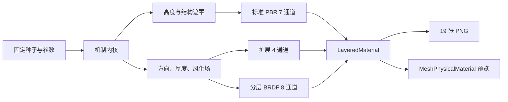

# 第四批：分层着色系统材质

第四批把 Meshova 从“生成 PBR 贴图”扩展为“生成材质机制、分层 BRDF 参数与贴图”。所有机制使用固定种子，Node 烘焙与浏览器预览共享同一实现。

## 快速使用

烘焙全部 10 套材质，默认分辨率 256：

```bash
pnpm materials-fourth:bake -- 256
```

只烘焙汽车漆：

```bash
pnpm materials-fourth:bake -- 512 layeredAutomotivePaint
```

输出位于 `out/materials/fourth-batch/<材质名>/`。每套输出 19 张 PNG。

## 数据流



## 机制内核

公开 API 位于 `src/texture/shading-mechanics.ts`。

| API | 输入 | 输出 | 主要用途 |
|---|---|---|---|
| `reactionDiffusion` | 尺寸、Gray-Scott 参数、种子 | 激活剂、抑制剂、归一化图案 | 铜锈、菌落、斑驳釉 |
| `growCracks` | 起点、步数、分叉率、转向、宽度 | 裂纹、层级、边缘翘起 | 裂纹釉、焦木、风化墙 |
| `buildThicknessField` | 遮罩、高度、厚度上限 | 厚度贴图 | 玉石、蜡、生物膜 |
| `beerLambertAbsorption` | 入射色、厚度、RGB 吸收率 | 吸收后颜色 | 玉石、蜡、半透明组织 |
| `thinFilmInterference` | 厚度、IOR、相位、强度 | RGB 干涉色 | 珠母、油膜、镀膜 |
| `weatheringTransport` | 高度、降雨、蒸发、孔隙率 | 潮湿、盐析、霉变、剥落 | 铜锈、沙滩、古墙 |
| `makeFiberTensorField` | 方向、湍流、交织率 | 张量、方向、各向异性、交叉 | 丝绸、天鹅绒、木纹 |
| `analyzeTextureQuality` | 任意贴图 | 横纵接缝误差、Mip 稳定性 | 无缝与远景稳定检查 |

机制函数不修改输入。相同参数与种子始终产生相同结果。

## 19 通道约定

标准 7 通道：`baseColor`、`metallic`、`roughness`、`normal`、`ao`、`height`、`emission`。

扩展 4 通道：`opacity`、`transmission`、`anisotropy`、`anisotropyRotation`。

分层 BRDF 8 通道：`clearcoat`、`clearcoatRoughness`、`sheen`、`sheenColor`、`thickness`、`subsurface`、`iridescence`、`iridescenceThickness`。

`LayeredMaterialPhysical` 保存 IOR、清漆、Sheen、虹彩、次表面和吸收距离等标量上限。贴图保存逐像素权重。

## 10 套材质

| 注册名 | 视觉目标 | 主机制 |
|---|---|---|
| `layeredAutomotivePaint` | 金属底、色漆、清漆、橘皮 | 多层 BRDF、金属碎片、清漆 |
| `translucentJadeWax` | 内部云雾、脉络、透光 | 厚度、Beer-Lambert 吸收、次表面 |
| `directionalVelvetSilk` | 经/纬结构、掠射高光 | 纤维张量、各向异性、Sheen |
| `nacreOilFilm` | 彩虹视角色变 | 薄膜干涉、清漆、虹彩厚度 |
| `reactionPatinatedCopper` | 铜绿岛状传播 | 反应扩散、潮湿传输、金属分层 |
| `crackleCeramicGlaze` | 收缩裂纹、翘边、积污 | 分叉裂纹、反应斑驳、清漆 |
| `thermallyCharredWood` | 炭化、灰烬、纵裂 | 纤维方向、层级裂纹、热影响混合 |
| `tidalBeachSediment` | 波纹、湿线、盐霜、贝壳 | 风化传输、周期波纹、单元分布 |
| `competitiveBiologicalColony` | 细胞竞争、膜层、脉络 | 反应扩散、厚度、次表面、Sheen |
| `ancientWeatheredWall` | 渗水、盐析、霉菌、剥落 | 风化传输、裂纹生长、分层暴露 |

## 复刻边界

- 当前为确定性 CPU 贴图内核，不模拟光谱级路径追踪。
- Three.js 无原生通用次表面散射贴图；浏览器用透射、厚度和衰减近似。导出的 `subsurface` 通道保留给 WebGPU 或离线渲染器。
- 薄膜干涉使用三波长近似。它保留随厚度变化的综合色相，不替代完整光谱积分。
- 风化模型表达降雨、毛细滞留、蒸发前沿与沉积关系，不求解真实化学反应速率。

## 验证

```bash
pnpm exec vitest run test/shading-mechanics.test.ts test/fourth-batch-materials.test.ts
pnpm typecheck
pnpm build
```

测试覆盖确定性、参数生效、物理范围、机制输出、19 通道导出、无缝误差和 Mip 稳定性。
