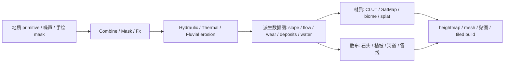

# Gaea 地形生成原理与 Meshova 方案

## 调研结论

Gaea 的核心不是“随机噪声位移平面”，而是 heightfield 数据流。



关键点：

- **节点图本质**：每个节点输入/输出 heightfield、mask 或 color map；Combine 用 blend/add/max/min/power 等方式合成，并能给材质分离 mask。
- **侵蚀链**：Hydraulic、Thermal、Fluvial 分工。Thermal 偏 talus/debris 和削峰，Fluvial 偏二次河流切割；实际制作常串联多个 erosion 节点。
- **数据图驱动材质**：Gaea 颜色节点把 height/flow/wear/angle 等数据映射到 CLUT/SatMap/Biome，不靠单张手绘贴图。
- **生产侧**：Gaea 2.3 加强 macro/automation、erosion 艺术控制、regions/large worlds；2.2 已有 Erosion_2 选择性降雨、坡度/海拔/mask 控制。

## Meshova 落地方案

先做 **Gaea-lite heightfield core**，不做节点 UI：

- `Field2D` 作为统一 IR：height、mask、flow、wear、deposition 都是标量场。
- 地形 primitive：多尺度 fbm + ridged multifractal + island falloff + terrace。
- Combine 复用现有 `combineField2D`。
- 侵蚀 pass：CPU deterministic hydraulic + thermal 近似；后续可迁 WebGPU。
- 派生 masks：slope、flow accumulation、convexity、water、wear、deposition。
- mesh/material view：heightfield 转 mesh；mask 生成 vertex color，后续接 surface material / splat map / foliage scatter。

## 已引入的第一步

- 新增 `src/terrain/heightfield.ts`
- 新增 `buildTerrainField()`：primitive -> erosion -> masks -> mesh + vertex colors
- 新增 `makeTerrainPrimitiveField()`、`erodeTerrainHeightfield()`、`deriveTerrainMasks()`、`heightfieldToTerrainMesh()`
- 新增 `test/terrain-heightfield.test.ts`

## 已引入的第二步

把 Gaea 值得学的三件事落到脚本 API：

- `TerrainFieldSet`：把 `height/slope/flow/convexity/water/wear/deposition` 作为一等数据图，统一给材质、散布、AI 评分使用。
- `TerrainRecipe`：高层 recipe 执行器，支持 base primitive、多层 combine、选择性 erosion、mesh 输出。
- `mutateTerrain()`：同一个 recipe 批量变 seed/参数，输出候选结果和指标，给 headless 截图/VLM/黑盒优化接入。

示例：

```ts
import { islandTerrainRecipe, mutateTerrain, runTerrainRecipe } from "meshova";

const recipe = islandTerrainRecipe(7);
const terrain = runTerrainRecipe(recipe);
const candidates = mutateTerrain(recipe, { count: 8, seed: 99, amount: 0.15 });
```

## 下一步建议

1. 把 `src/models/terrain.ts` 岛屿模型改成 `TerrainRecipe`。
2. 加 river/lake 专用 pass：`flow carve`、`lake fill`、`coastline shelf`。
3. 把 masks 接入材质：terrain splat、wetness、snowline、rock slope、sand beach。
4. 加 tiled build：大形低频全局算，高频细节 tile 内重算。
5. WebGPU 加速 erosion 与 tiled build。

## 资料来源

- Gaea 官方文档首页：https://docs.quadspinner.com/
- Combine 节点：https://docs.quadspinner.com/Reference/Adjustments/Combine.html
- Thermal erosion：https://docs.quadspinner.com/Reference/Erosion/Thermal.html
- Fluvial erosion：https://docs.quadspinner.com/Reference/Erosion/Fluvial.html
- Gaea color nodes / CLUT / FlowMap / Wear：https://medium.com/quadspinner/basic-tutorial-color-nodes-ae4a6ea24e3a
- Gaea 2.3 release notes：https://quadspinner.com/Download/Changelog
- Gaea 2.2 release notes：https://blog.quadspinner.com/gaea-2-2-released/
