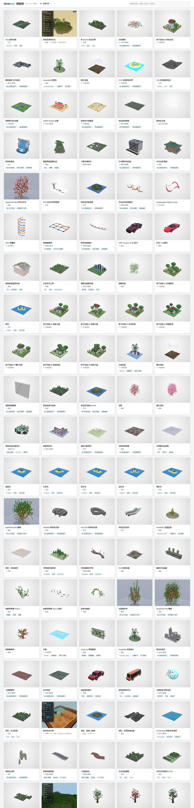
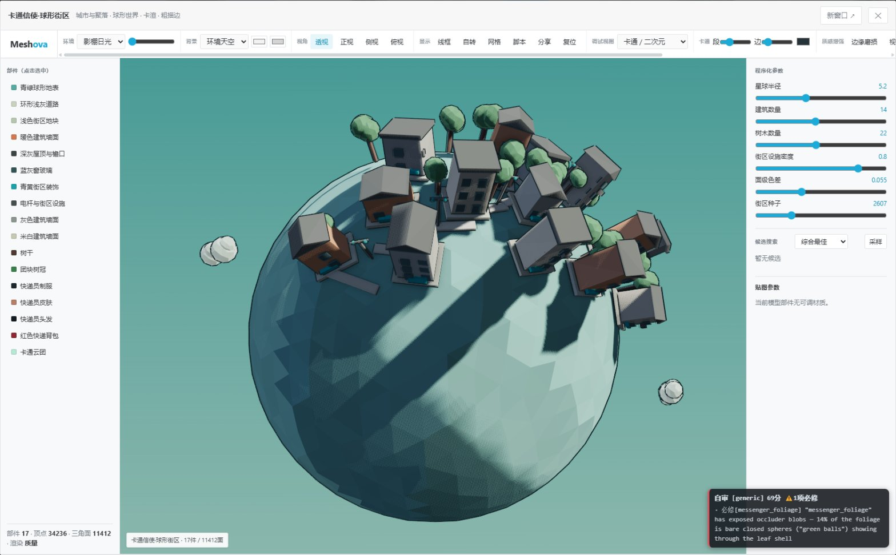
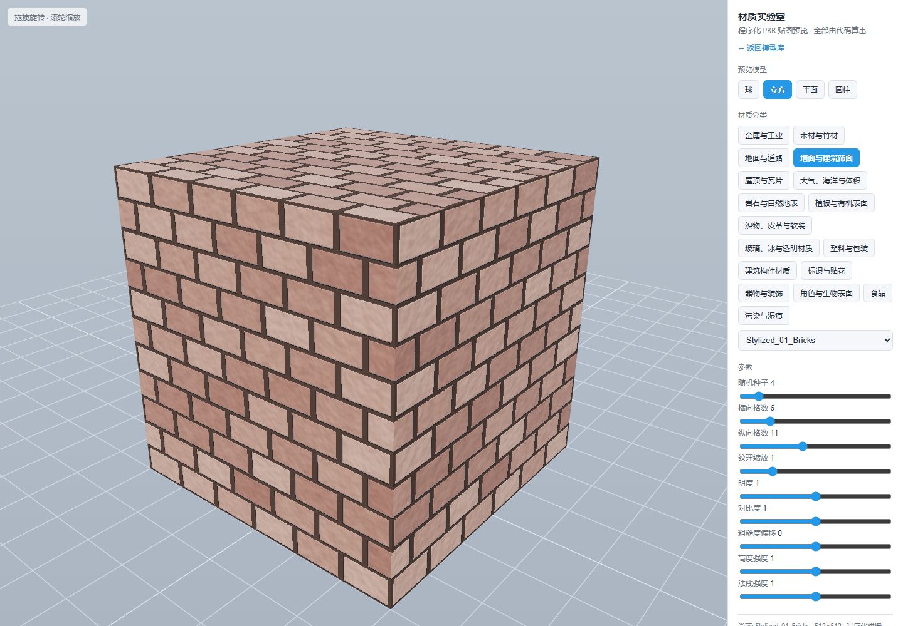
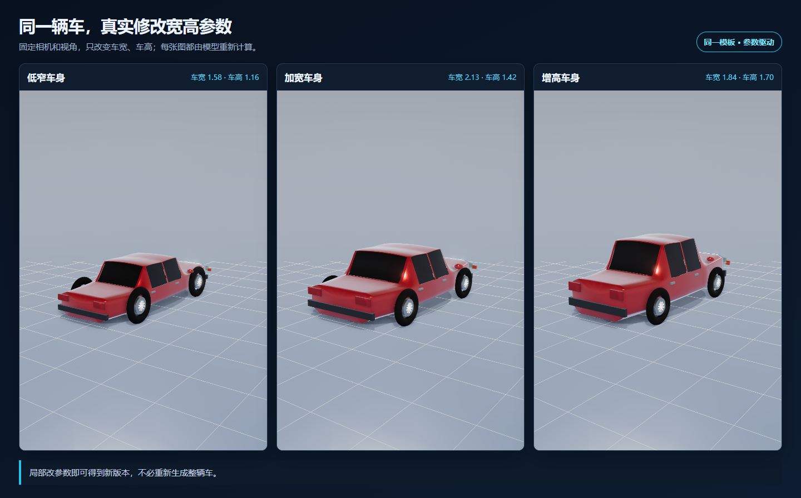
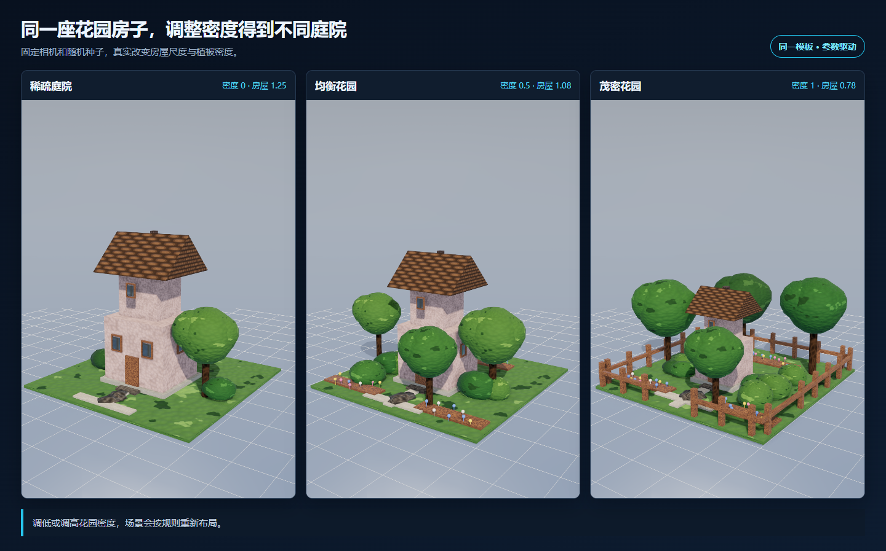
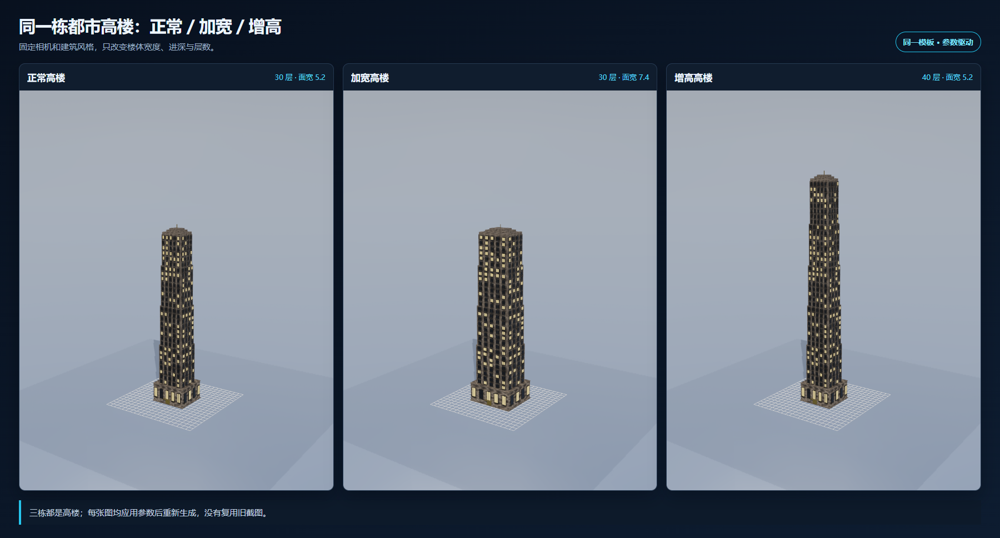

# AI时代的程序化建模

现在的 AI 3D 很擅长生成第一版：输入一句话或一张图片，很快得到一个模型。

但游戏生产更关心下一步。车身太窄，能否只改宽度？车顶太高，能否只改高度？材质错了，能否只换材质，不重做几何？半年后，能否用同样的输入重新得到同样的模型？

如果每次修改都要重新生成完整模型、重新描述全部要求、再次消耗大量 Token，模型就很难真正进入生产流程。

Meshova 采用另一条路线：**模型就是脚本**。

模型由 TypeScript 脚本和参数生成。AI 不只交付一次性的网格，还交付生成方法。结果不满意，只改相关参数或局部规则，不必从头再来。

这样做有几个直接好处：

- AI 易于阅读：代码、参数和结构都是大模型熟悉的表达。
- AI 易于校验：脚本能做类型检查、测试、截图对比和视觉评分。
- 文件小、易传播：分享脚本、参数、版本和随机种子，即可复现模型。
- 非节点化：不用让 AI 模拟鼠标连接复杂节点图。
- 可反复修改：局部修改即可，不必多次花费 Token 重做全部内容。
- 模板可复用：从现有案例出发，比每次从空白开始更稳定。

## 一、什么是程序化建模

传统建模常通过移动顶点、拉面、雕刻等方式直接修改网格。程序化建模则先写清生成规则，再由程序计算出网格。

以汽车为例，脚本会描述车长、车宽、车高、轴距、轮胎尺寸、车窗位置等参数。修改车宽后，系统重新计算车身、玻璃、轮组和灯具的位置，得到一辆新车。

它不是把模型“锁死”在一个结果里，而是保留一套可以继续调整的生成方法。

这很适合需要批量变体的内容：车辆、建筑、道路、地形、植被、岩石、家具，都能从一套模板生成多个稳定版本。

同一个球形街区模板，可以继续调整星球半径、建筑数量、树木数量和随机种子，而不是重新手工摆放全部内容。

## 二、什么是程序化贴图

程序化贴图不是直接保存一张固定图片，而是用噪声、颜色渐变、图案、遮罩和材质规则计算表面。

例如生锈金属可以这样理解：

- 底层是金属颜色。
- 凹陷和边缘使用不同的锈蚀规则。
- 粗糙度控制表面亮不亮。
- 高度和法线制造细小起伏。
- 随机种子决定锈斑分布。

修改锈蚀程度、颜色或纹理尺度后，贴图会重新生成。它仍然可编辑，也能和模型尺寸一起变化。

Meshova 的程序化 PBR 材质包含基础色、金属度、粗糙度、法线、AO、高度和自发光等通道。目标不是复刻参考图的每个像素，而是保证材质类别和整体质感正确。

## 三、为什么“模型就是脚本”适合 AI

AI 擅长读写文字和代码。车身太窄，就修改“车宽”；车顶太高，就修改“车高”。不用重新描述整辆车，也不用重新生成全部内容。

脚本还是普通文本，文件小，方便分享，也能进入 Git。谁改了什么、哪次修改更好，都能比较和回退。

Meshova 不把节点图作为主要格式。节点图适合人拖拽，但 AI 要反复寻找节点、接口和连线。脚本更直接，也更容易检查是否写错。

## 四、程序化模型如何工作

可以把 PCG 模板理解成一份“可调整的模型配方”。汽车模板已经知道车身、车窗、车轮和车灯如何组合；AI 只需选择接近目标的模板，再修改尺寸、比例、颜色和材质。

模板负责常见结构，参数负责变化。AI 不必每次从空白开始，结果也更稳定。

以流线城市轿车为例，同一份脚本只修改车宽、车高，就能得到不同造型：

下面三张图固定相机和视角，分别使用标注参数重新计算模型，不是缩放图片，也不是重复使用同一张截图。

这里只修改了参数。车身、玻璃和轮组按规则自动联动。AI 不必重新编写整辆车，修改范围小，重复 Token 消耗也更低。

同样的方法也适用于完整场景。固定随机种子，只调整房屋尺度、树木和花朵密度，场景就会从稀疏庭院真实重建为茂密花园：

都市高楼也固定相机和风格。正常版和加宽版都是 30 层，加宽版只扩大楼体宽度和进深；增高版提升到 40 层。三栋都保持高楼体量：

## 五、为什么结果可以反复复现

Meshova 会保存脚本、参数和随机种子。三者相同，生成结果也相同。

随机种子可以理解为“变化编号”。换一个编号，树叶、石块、锈斑会变化；编号不变，结果不会偷偷改变。这样才能放心分享、继续修改和比较前后版本。

## 六、网页端直接生成和渲染

Meshova 使用 TypeScript，同一套模型逻辑可以在命令行运行，也可以在浏览器运行。

项目部署到 GitHub Pages 后，其他人打开链接即可查看模型、切换视角、调整参数。分享的不只是截图或网格，也可以是一个仍能继续修改的模型页面。

浏览器还是 AI 的观察窗口。系统可以自动打开模型、设置参数、从多个视角截图，再检查轮廓、比例和材质。代码通过不代表模型一定好看，最终仍要看渲染结果。

当前主查看器使用 Three.js WebGLRenderer。WebGPU 用于逐步扩展计算能力，不把尚未完成的迁移写成现成功能。

## 七、从图片生成可编辑模型

图片可以作为建模输入，但 Meshova 不希望把图片直接变成一块难以修改的死网格。

它采用更容易维护的流程：

1. AI 先识别图片中的物体和部件，例如车身、车窗、车轮和车灯。
2. 从 PCG 案例库选择接近的模板。
3. 根据图片估计长宽高、部件位置和材质类别。
4. 生成或修改脚本，在网页端渲染。
5. 把截图和参考图比较，只保留真正变好的版本。

单张图片看不到背面，也无法准确提供深度，所以系统不会假装完全恢复真实模型。它的目标是生成结构合理、造型接近、还能继续修改的程序化资产。

造型优先于纹理复刻。轮廓和多视角比例先正确，再判断金属、塑料、木材、布料等材质类别，避免把金属做成皮革。

## 八、参数必须让人和 AI 都看得懂

程序化系统不能只增加参数数量，还要保证参数有意义。

Meshova 使用“车身外壳”“前挡风玻璃”“前轮胎”这类语义名称，不把 `root.0`、`component_1` 等导入器名称当作主要标签。

当视觉检查发现“车身过窄”时，AI 可以直接修改车宽；发现“前轮过小”时，可以修改前轮半径。问题能落回明确参数，自动迭代才真正可用。

## 九、PCG 模板同时覆盖模型和材质

Meshova 不要求 AI 每次从空白开始。案例既是展示内容，也是可读取、可修改、可组合的模板。

按模型定义、材质模板和参数变体计算，项目内容总量已超过 1000 项；网页模型库去重后接近 1000 个可浏览条目。

模型模板覆盖车辆、建筑、道路、地形、植被、岩石、角色体块和硬表面物件。材质模板覆盖金属、木材、布料、陶瓷、玻璃、岩石、砖墙等常见类别。

几何和材质共用参数、随机和空间规则。例如同一组侵蚀规则既可以改变岩石轮廓，也可以影响表面的颜色、粗糙度和高度，让造型与材质保持一致。

## 结语：AI 时代，生成方法也是资产

未来的 AI 3D 工具不应只比较谁能更快生成一张好看的截图。对游戏和实时内容生产来说，更重要的是结果能否修改、复现、测试、分享和持续维护。

Meshova 的答案是脚本。

人提出审美目标和生产约束，AI 编写与修改程序化脚本，Meshova 负责几何、材质、渲染和校验。最终模型只是某次计算结果，脚本和参数才是可以长期使用的资产。

项目地址：<https://github.com/wellingfeng/Meshova>

在线模型库：<https://wellingfeng.github.io/Meshova/index.html>
