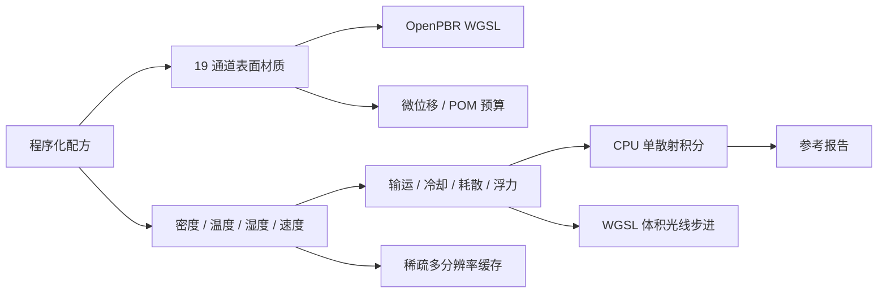

# 第九批：体积、海洋与微位移系统

最后更新：2026-07-12

本批建立体积材质与表面材质并行运行契约。19 通道继续服务 OpenPBR 表面；密度、温度、湿度、速度改用独立 3D 场。CPU 参考积分器用于验证 WGSL 光线步进结果，不把体积数据伪装成二维贴图。

## 快速使用

烘焙全部 10 套材质：

```bash
pnpm build
pnpm materials-ninth:bake -- 512
```

只烘焙一套：

```bash
pnpm materials-ninth:bake -- 256 evolvingCumulusCloud
```

输出位于 `out/materials/ninth-batch/<材质名>/`。每套包含 19 张 PNG、OpenPBR、MaterialX、表面 WGSL、体积 WGSL、交错 Float32 体积、描述文件、CPU 参考报告和运行清单，共 28 个文件。

## 数据流



## 体积 API

### `createProceduralVolume(options)`

生成确定性 `VolumeField`。标量通道分别存储密度、温度、湿度；速度按 XYZ 交错存储。

- 尺寸必须为正整数，否则抛错。
- `shape` 支持 `box`、`sphere`、`layer`、`plume`。
- 相同 `seed` 与参数产生相同 Float32 数据。
- 时间和空间复杂度均为 `O(width * height * depth)`。

```ts
import { createProceduralVolume } from "meshova";

const cloud = createProceduralVolume({
  width: 32,
  height: 20,
  depth: 32,
  seed: 42,
  shape: "sphere",
  density: 0.9,
  humidity: 1,
});
```

### `evolveVolume(field, options)`

执行一次周期边界半拉格朗日输运。返回新体积，不修改输入。

- `timeStep`：回溯步长。
- `dissipation`：密度耗散率。
- `cooling`：温度衰减率。
- `evaporation`：湿度蒸发率。
- `buoyancy`：温度驱动上升速度。
- `combustion`：燃烧增温与燃料转化近似。

### `integrateVolumeReference(field, ray, options)`

CPU 单散射参考积分器。返回 RGB、透射率、光学深度与采样数。使用 Henyey-Greenstein 相位函数、Beer-Lambert 消光和黑体色近似。

当前积分器用于回归基准，不替代离线路径追踪。它不计算多次散射、体积间接光和真实火焰化学。

### `VOLUME_RAYMARCH_WGSL`

WebGPU 3D 纹理光线步进器。绑定密度、温度、采样器和 `VolumePhysical`。CPU 与 WGSL 使用相同消光、相位函数和提前终止规则。

### `buildVolumeMipChain(field)`

生成 ceil 尺寸 Mip 链。奇数边界不会丢失。每级记录活跃体素数，可供稀疏块剔除与显存预算使用。

### `fitTemporalVolume(initial, observations)`

从视频或时间序列统计拟合耗散、冷却、浮力。当前输入是每帧平均密度和温度，不直接解析视频像素。搜索确定性；空观测数组抛错。

## 海洋与位移 API

### `sampleOceanSpectrum(x, z, time, waves)`

叠加 Gerstner 波。返回高度、法线、垂直速度和浪尖泡沫种子。空波组返回平面。

### `transportOceanFoam(foam, velocity, options)`

在二维周期速度场内输运、扩散和消散泡沫。泡沫必须为单通道；速度必须为匹配尺寸的双通道，否则抛错。

### `planMicroDisplacement(height, options)`

根据高度最大坡度和屏幕误差预算计算细分级别。结果包含细分次数、细分因子、最大坡度和估计误差。

### `parallaxOcclusionUv(height, uv, view, heightScale, steps)`

CPU POM 参考采样。用于验证材质图和确定 GPU 步数，不生成真实轮廓。

## 第九批材质

| 标识 | 材质 | 运行模式 | 核心机制 |
|---|---|---|---|
| `evolvingCumulusCloud` | 演化积云 | 体积 | 密度、风场、银边 |
| `combustionFireAndSmoke` | 火焰与烟雾 | 体积 | 温度、黑体辐射、烟羽 |
| `spectralOceanSeafoam` | 海水与浪花 | 混合 | 波谱、泡沫、吸收 |
| `compactedSnowIceCrust` | 雪层与冰壳 | 混合 | 压实、晶粒、融冻裂纹 |
| `foldedErodedRockStrata` | 岩层断面 | 表面 | 褶皱、断裂、微位移 |
| `deformableWetSandMud` | 湿沙泥浆 | 表面 | 颗粒、足迹、积水 |
| `flowingMoltenGlass` | 熔融玻璃 | 混合 | 温度、流动、吸收 |
| `displacedBarkMossGrowth` | 树皮苔藓 | 表面 | 裂片、生长、微位移 |
| `geometricWovenYarn` | 纱线织物 | 表面 | 经纬交叠、毛羽、LOD |
| `anisotropicLayeredFeather` | 分层羽毛 | 表面 | 羽枝、薄层透射、虹彩 |

通用参数：`seed`、`scale`、`detail`、`amount`、`color`、`accentColor`、`roughness`、`displacement`、`time`。

## 资产包契约

`exportNinthBatchMaterialBundle(material, baseName)` 在 23 文件实时表面包上追加：

- `<name>.volume.f32`：每体素 6 个 little-endian Float32。
- `<name>.volume.json`：尺寸、布局、格式和数据 URI。
- `<name>.volume.wgsl`：体积光线步进器。
- `<name>.reference.json`：CPU 光照与微位移基准。
- `<name>.ninth.json`：表面和体积入口清单。

表面模式仍输出零密度体积。这样加载器使用统一布局；运行时可根据清单中的 `mode` 跳过 3D 纹理上传。

## 已知边界

- WebGL 材质实验室显示表面代理；完整体积只由 WebGPU WGSL 消费。
- 体积输运使用周期边界，无压力投影和不可压缩 Navier-Stokes 求解。
- 火焰采用温度与黑体近似，无燃料组分和化学反应网络。
- 海洋使用有限 Gerstner 波组，不含 FFT 频谱、破碎波几何和真实焦散。
- 微位移模块输出预算与 POM 参考，不直接修改网格拓扑。
- CPU 积分器是正确性基线，未针对大体积优化；生产运行应使用 3D Mip、空体素跳跃和 GPU。

## 验证

```bash
pnpm exec vitest run test/volume-material-system.test.ts test/ninth-batch-materials.test.ts
pnpm typecheck
pnpm build
```

测试覆盖确定性、耗散和透射单调性、奇数尺寸 Mip、波谱、微位移、时间拟合、19 通道合法性及 28 文件资产导出。
