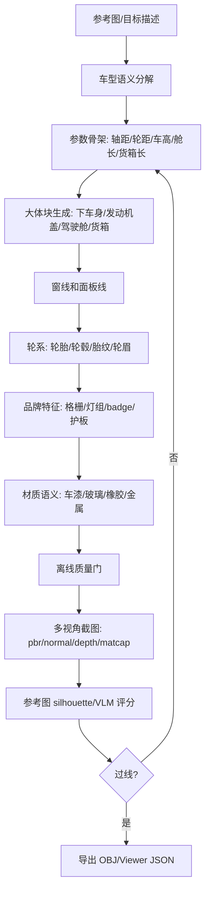

# 程序化载具生成流程

目标：Meshova 生成载具时，先保证“像某类车”，再追具体型号。失败顺序固定：

1. 类别骨架错：再多细节也救不回。
2. 视图轮廓错：单张透视容易骗过人眼。
3. 语义细节错：有灯、有轮、有格栅，但位置/比例不对。
4. 材质错：金属、玻璃、橡胶、车漆类别混乱。

## 外部流程要点

- Houdini/节点式硬表面：把 body、groups、panels、wheels、trim 拆成可命名组；节点链可回溯，先大体块后附件。
- CityEngine/CGA：规则先定义分割、重复、组件选择；适合把“车身长度 -> 舱/货箱/发动机盖分段”表达成规则。
- Blender Geometry Nodes：属性/实例驱动重复件；适合轮胎胎块、铆钉、灯组、格栅阵列。
- CARLA/自动驾驶资产：车辆资产重视 blueprint、颜色、类别、轮廓、传感器视角一致；不是只看渲染是否成功。
- 学术车体重建流程：常用多视角轮廓、关键点、可变形/参数化车体模型；参考相似度比“部件存在”更重要。

参考：

- https://www.sidefx.com/docs/houdini/basics/intro.html
- https://doc.arcgis.com/en/cityengine/latest/help/help-cga-modeling-overview.htm
- https://docs.blender.org/manual/en/latest/modeling/geometry_nodes/attributes_reference.html
- https://carla.readthedocs.io/en/latest/bp_library/
- https://eprints.gla.ac.uk/276367/

## Meshova 载具流程



## 车辆质量门

离线门只管“基本不像车”的错误：

- `requiredParts`：下车身、发动机盖、驾驶舱、玻璃、货箱、格栅、轮眉、底盘等必须存在。
- `proportions`：长宽比、宽高比、轴距比、轮胎半径比、轮距比。
- `cabBedLayout`：发动机盖/驾驶舱/货箱比例，玻璃高度和位置，门缝/把手。
- `wheelSystem`：四轮、轮胎、轮毂、hub、胎块。
- `brandSignature`：GMC badge、黑格栅、C 灯、护板、拖钩、轮眉。
- `vehicleSemantics`：车漆、橡胶、玻璃、金属材质不能串类。
- `solidity`：CPU turntable silhouette 不得在某个视角塌成薄片。

参考相似度门另算：

- 固定 `front/side/top/3q`，另加 `normal/depth/matcap`。
- 参考图先 canonicalize：主体裁切、透明/纯背景、尺度归一。
- 分数：silhouette IoU + 关键比例 + VLM 语义清单。
- 阈值不过，不许继续堆附件。

当前命令：

```powershell
pnpm quality:canyon
pnpm quality:riviera
pnpm shot gmc-canyon-at4x "persp,front,side,top" "" "pbr,normal,depth,matcap"
pnpm shot buick-riviera-1965 "persp,front,side,top" "" "pbr,normal,depth,matcap"
pnpm score:ref out/refs/canyon-side.png out/shots/gmc-canyon-at4x-side.png --threshold=0.72
```

`quality:canyon` 没有参考图，只能判“是不是合格皮卡骨架”。  
`quality:riviera` 没有参考图，只能判“是不是合格 60 年代两门硬顶 coupe 骨架”。  
`score:ref` 有参考图，才判“像不像目标 Canyon”。

## Classic coupe 质量门

`scoreClassicCoupeVehicle()` 用于 Riviera 这类低矮两门 personal luxury coupe：

- `requiredParts`：长 hood、短 deck、硬顶车窗、前后 chrome bumper、grille、badge、底盘。
- `proportions`：长宽比、宽高比、轴距比、轮胎半径比、轮距比。
- `coupeLayout`：长 hood/短 deck/硬顶玻璃比例，只允许两门切线和两门把手。
- `wheelSystem`：四轮、whitewall、chrome hubcap、spinner cap。
- `brandSignature`：Riviera clamshell 隐藏灯、knife-edge 直线车身折线、rocker chrome、tri-shield。
- `vehicleSemantics`：carPaint/chrome/rubber/glass 不串类。
- `solidity`：多角度 silhouette 不塌。

## 载具生成优先级

1. 轮距、轴距、车高。
2. 侧面轮廓：引擎盖、A/B/C 柱、窗线、货箱上沿。
3. 正面识别：格栅面积、灯组轮廓、保险杠层次。
4. 轮系可信度：轮胎半径、轮拱位置、胎纹密度。
5. 品牌/版本细节：badge、AT4X 越野护件、拖钩、sport bar。

结论：载具不能用“零件名清单”验收。必须先过车类骨架，再过目标参考图。
