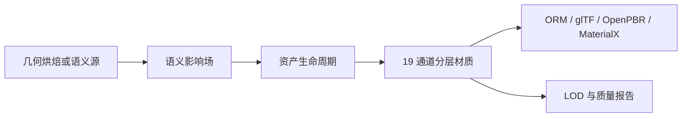

# 第七批：几何语义驱动资产材质

本批把材质从“表面长什么样”推进到“资产如何被使用”。接触、负载、热区、雨流、水线、边缘与凹腔共同驱动磨耗、抛光、掉漆、积污、氧化、积碳和水垢。

## 快速使用

烘焙全部 10 套材质：

```bash
pnpm materials-seventh:bake -- 512
```

只烘焙一套：

```bash
pnpm materials-seventh:bake -- 512 contactPolishedBrass
```

输出位于 `out/materials/seventh-batch/<material>/`。每套包含 19 张分层 PBR 贴图、ORM、OpenPBR、MaterialX、glTF 材质片段、资产质量报告，共 24 个文件。

## 数据流



## 核心 API

### `deriveSemanticSurfaceFields(size, options)`

生成八张标量场：`edge`、`cavity`、`exposure`、`runoff`、`contact`、`heat`、`load`、`waterline`。

- `size`：整数，最小值 `4`。非法值抛出错误。
- `options.geometry`：可选 `GeometryTextureBake`。尺寸必须与 `size` 一致。
- `contactSources`、`heatSources`、`loadSources`：椭圆、条带或环形语义源。
- `rainDirection`：雨流方向。
- `waterline`：归一化水线高度。

```ts
const fields = deriveSemanticSurfaceFields(256, {
  seed: 12,
  contactSources: [
    { center: [0.5, 0.5], radius: [0.25, 0.4], shape: "ellipse" },
  ],
  rainDirection: [0.15, -1],
});
```

### `simulateAssetLifecycle(fields, options)`

把语义场演化为 `wear`、`polish`、`coatingLoss`、`grime`、`oxidation`、`carbon`、`mineral`。

- `time`：使用年限，范围 `[0, 1]`。
- `moisture`、`salinity`、`traffic`、`temperature`、`cleaning`：环境与使用强度。
- 输入必须是同尺寸方形单通道纹理，否则抛出错误。

### `exportAssetReadyMaterial(material, baseName, lifecycle?)`

导出资产级文件集：

- 标准 7 通道与扩展 12 通道。
- `*_orm.png`：R=AO，G=Roughness，B=Metallic。
- `*.gltf-material.json`：glTF 材质片段，引用 ORM 与物理扩展贴图。
- `*.openpbr.json` 与 `*.mtlx`：DCC/离线渲染互通。
- `*.asset-report.json`：均值、LOD 粗糙度漂移、风险提示。

### `buildTextureLodPyramid(texture, levels)`

生成确定性盒式过滤 Mip。奇数尺寸使用 `ceil` 保留边界像素；不会丢弃最后一行或最后一列。

## 复刻材质

| 名称 | 关键机制 |
|---|---|
| 接触抛光黄铜 | 手持区抛光、凹腔积污、潮湿铜绿 |
| 崩漆工具钢 | 负载边缘掉漆、钢基暴露、握持油污 |
| 热区养锅铸铁 | 环形热区、积碳、油膜、铸造微孔 |
| 水线附着船体 | 水线盐蚀、掉漆、海生附着 |
| 钢筋锈胀混凝土 | 裂缝、锈胀、雨流渗色 |
| 人流抛光木楼梯 | 双脚路径、压实抛光、木纹方向 |
| 乘坐压痕车座皮革 | 人体接触、压实发亮、皱褶毛孔 |
| 水垢陶瓷盆 | 水线、滴流、矿物沉积、清洁擦除 |
| 雨流铜绿屋面 | 板缝、朝向暴露、雨流铜绿 |
| 交通磨耗安全地坪 | 车辆通道、防滑纹、油污、底钢暴露 |

## 学习来源与复刻边界

重点学习 Substance 3D Smart Materials/Smart Masks、Mari 几何遮罩、OpenPBR、MaterialX、glTF `KHR_materials_*` 扩展与 AAA 资产磨损分层流程。

当前语义传播发生在二维烘焙域。`geometry` 输入能提供 AO、曲率、高度与覆盖，但尚未计算真实网格测地线、应力有限元或流体仿真。glTF 输出是可嵌入材质片段，不包含完整网格、缓冲区或 KTX2 压缩。

## 性能

核心复杂度约为 `O(size² × iterations)`。材质实验室实时预览只计算当前材质；批量命令逐套写盘，避免同时保留全部高分辨率贴图。
